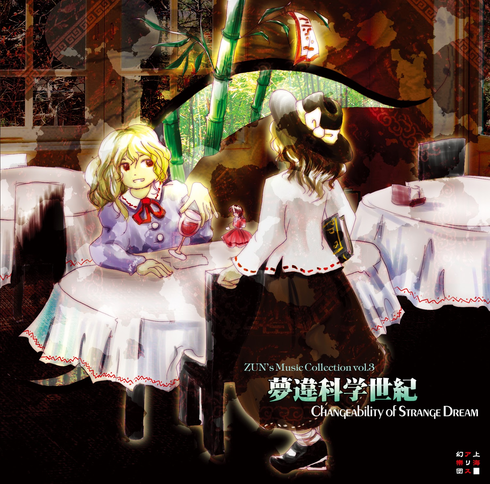

# Changeability of Strange Dream / Alterabilidade do Sonho Estranho (Tradução)

## História

**Um coelho lunar e um veículo de exploração lunar―  
É uma ilusão ou realidade; um sonho agradável ou um pesadelo?**

### ***[Festival Infantil ~ Tesouros Inocentes](https://en.touhouwiki.net/wiki/Lyrics:_%E7%AB%A5%E7%A5%AD_%EF%BD%9E_Innocent_Treasures_(ZUN))***
> Mudança de sonho, a memória de um mundo de névoa matinal ilusória.  
Este mundo atual, assentado sobre uma base de areia em ruínas.   
A história de um sonho fabricado, falando de um mundo antigo e profundo.  
Sob a luz do sol, uma cidade afunda.

> *(O amanhecer está começando. Dentro da névoa ilusória da manhã, o amanhecer está começando.  
Brinquei com as crianças no mundo fantasmagórico.  
As crianças estavam todas se divertindo. Todas estavam sorrindo).*

> É uma ilusão ou uma torre construída sobre a areia?  
Este sonho, até o amanhecer, é um [sonho de borboleta](https://en.wikipedia.org/wiki/Zhuangzi_(book)#%22The_Butterfly_Dream%22).

> *(…Quando foi a última vez que vi crianças sorrindo tanto?  
Músicas misteriosas que eu nunca tinha ouvido; danças misteriosas que eu nunca tinha visto. Parece que hoje há um festival.  
Desejei que um dia eu também pudesse viver em uma terra onde as crianças sorriem assim.)*

> Mudança de sonho, a cor conspícua de uma mansão escarlate ilusória.  
Este mundo atual, assentado sobre um alicerce de pedra sem coração.  
Um conto de fadas de um sonho fabricado, falando de uma antiga e bela capital.  
Sob a luz do sol, uma cidade é contaminada.

### *Sonho de Huaxu*
***"Sonho Paradisíaco"***
> "…E foi isso que aconteceu. Eu tive um sonho como esse ontem."  
 "…então você está falando sobre seus sonhos novamente?"  
 "Naturalmente. Eu a convidei para vir aqui porque queria conversar com você sobre eles."

> Meu nome é **Maribel Hearn**. Faço parte de um clube de ocultismo nesta cidade sombria. No entanto, diferentemente de um clube de ocultismo comum, não realizamos nenhuma das atividades espirituais sensatas que se poderia esperar. É o que se pode chamar de um clube defeituoso… mesmo antes de acrescentar que esse "clube" tem apenas dois membros.

> "Ei, as coisas que acontecem em seus sonhos são realmente algo que você deveria estar incomodando outras pessoas?"

> Mas, deixando isso de lado, tenho um poder incrível. Desde os tempos antigos, os membros da linhagem de minha família têm uma espécie de sensibilidade espiritual…  
Consigo ver limites – em outras palavras, fronteiras – em todo o mundo. O objetivo do nosso clube é procurar fendas nessas fronteiras, lugares onde se pode mergulhar em outro mundo. 
Poderíamos chamar isso de algo como "viajar de espírito"?

> …No entanto, esse tipo de coisa é proibido.  
Mas, recentemente, comecei a ver todos os tipos de outros mundos em meus sonhos…

> "Por favor, se eu não falar com você sobre as coisas nesses sonhos e receber seu conselho, eu não sei se serei capaz de contar qual de mim é real."

### ***Casa de Chá Escarlate de Xangai ~ Chá Chinês***

> Além das paredes verdes, havia [uma grande mansão em um vermelho profundo.](https://en.touhouwiki.net/wiki/Scarlet_Devil_Mansion)  
Em volta da mansão havia uma floresta em um verde profundo e [um lago branco cintilante](https://en.touhouwiki.net/wiki/Misty_Lake)...  
Que vista linda, não é?  
Para algo tão vermelho, consegue misturar-se perfeitamente com o ambiente.  
A cor forte parece infantil, de certa forma, mas... Eu adoro-a.

> Será que posso dar uma olhada lá dentro, só por um minuto ou dois?  
Mas não seria rude aparecer sem avisar?  
Além disso, será que uma mansão como esta me deixaria entrar?  
Espera, perder a cabeça num sonho, de todas as coisas? Graças a mim.

> ...Oh céus, saiu [uma empregada](https://en.touhouwiki.net/wiki/Sakuya_Izayoi) de lá.  
Talvez eu deva perguntá-la?  
Eu gostaria de cumprimentar [a dona de uma mansão tão bonita](https://en.touhouwiki.net/wiki/Remilia_Scarlet).

### ***Viagem 1969***
***1969, do Cabo Canaveral***

> O cenário era o mesmo, não importava o quanto eu andasse.  
O sol já tinha se posto, e eu não conseguia nem mesmo ver o chão sob meus próprios pés...

> À noite, é muito fácil se perder numa floresta de bambu.  
De vez em quando, ouvia gritos estranhos de longe. Seriam de animais, ou talvez...  
O que fazer agora? Isto era inútil.  
Ia andar em círculos neste bambuzal até morrer de fome?  
Ou talvez fosse comido por um youkai? Ah, mas havia tantas coisas que me faltavam fazer...

> Vagueei sem rumo.  
Uma voz no fundo da minha mente disse que eu provavelmente não passaria fome, porque poderia sobreviver comendo brotos de bambu.  
...Mas, para começar, isto era um sonho, não era?  
Mas depois percebi que não fazia ideia de que tipo de coisa eram os brotos de bambu naturais.  
Só tinha visto os sintéticos. Tudo o que eu sabia sobre eles era o sabor...

> Sem saber o que fazer, olho para o céu.  
Todo ele estava cheio de estrelas.  
Pela primeira vez, invejei os seus olhos.  
Se fosse você, saberia onde estava num instante; nunca iria se perder, não é?

> Assim que pensei nisso, ouvi uma gargalhada estranha vindo atrás de mim!

### ***Meninos e Meninas da Era da Ciência***
***“ Menino e Menina do Século XXI”***

> “Aqui estão os cookies que comprei na mansão escarlate, e os brotos de bambu naturais da floresta de bambu”.  
“Hã? Pensei que estava a falar de um sonho, Merry?”  
A menina que me está me ouvindo falar dos meus sonhos é **[Renko Usami](https://en.touhouwiki.net/wiki/Renko_Usami)**: a outra membra do nosso pequeno clube de dois, e aquela que inventa a maioria das nossas actividades. A Renko consegue saber onde está e que horas do dia são só de olhar para o céu. Medonho.  

> E também, a Renko me chama de Merry. As pessoas neste país parecem ter dificuldade em pronunciar o meu nome, ao ponto de me perguntar se alguém ainda se lembra dele.

> “ Eu **estou** a falar sobre meus sonhos. Eu te disse isso desde o início, não disse?”  
“...Mas se isso foram sonhos, então como é que você tem essas coisas aqui na realidade?”  
“É precisamente por isso que eu queria te consultar.”

> Está ficando difícil para mim dizer o que é um sonho e o que é realidade. Os sonhos normalmente terminam quando estou a sendo perseguida por um youkai. São pesadelos dignos de serem chamados de pesadelos, mas...  
Se continuo trazendo coisas dos meus sonhos sem perceber, então talvez até a conversa que estou tendo agora seja apenas um sonho...

> “ Está bem, aqui vai o meu primeiro conselho para você, Merry. Estes já não são brotos de bambu. Quando chegam a este tamanho, já são muito duros para comer.”  
Mas se eu pudesse transformá-los de pesadelos em bons sonhos, talvez preferisse-os ao invés da minha realidade atual...  
“Os brotos de bambu naturais escondem-se debaixo da terra, para se protegerem enquanto estão macios e saborosos.”

### ***Retribuição pela Noite Eterna ~ Noite Imperecível***

> Corri por amor à vida, apesar de estar num sonho.  
Não sabia o porquê, mas as gargalhadas que ouvia pareciam ser de algo que claramente não era humano.  
Os meus instintos diziam-me: “Corra!”

> Mas a floresta de bambus estava ligeiramente inclinada, o que me fez perder o meu sentido de equilíbrio.

> Tentei correr em linha reta, mas o que é que de fato aconteceu, pergunto-me?

> Embora parecesse que eu tinha corrido bastante, não havia nada para ver a não ser o mesmo cenário de antes.  
Será que esta floresta continuou pela eternidade, ou eu estava a correr em círculos?  
...Mas suponho que qualquer uma das duas coisas daria o mesmo resultado.

> Pensar de tal forma que “de um ponto de vista objetivo, existe uma verdade definitiva”, como faz Renko, é realmente ultrapassado.

> A verdade existe na subjetividade.  
Se eu só posso ter as mesmas vistas de novo e de novo... então é esse o tipo de lugar que é.

> E é por isso que estou correndo.  
Porque **sonhos** são nada menos que o antônimo da **realidade**.  
Segundo o conhecimento comum de hoje, os dois são sinônimos.  
Mesmo nos sonhos, é preciso fugir de coisas de natureza desconhecida. Essa é a verdade.

> O meu mestrado é psicologia relativista.  
O da Renko é física super-unificada. Me pergunto se o seu recente estudo de cordas está indo bem?

### ***Quedas da Noite ~ Estrela Vespertina***

> Mas... é estranho.  
Apesar de haver uma quantidade absurda de pessoas antiquadas como você, que consideram os sonhos e a realidade como opostos diretos, ouvi dizer que há muito, muito tempo atrás, as pessoas não distinguiam sonhos e realidade.

> E agora, distinguimos entre sonho e realidade, mas são a mesma coisa.  
A verdade da realidade e a verdade dos sonhos, o eu da realidade e o eu dos sonhos, ambos existem.

> Uma borboleta da noite ou um humano do dia...  
De acordo com o conhecimento comum atual, ambos sou eu.

> Senti que tinha corrido uma distância considerável, mas não me sentia nada fatigada.  
Será que é porque eu me movia como se estivesse voando no céu? Teria eu me transformado numa borboleta, pergunto-me?

> Mas eu conseguia ver a linha de chegada para este tipo de maratona de meia-noite...

> ... Parei de correr.  
Porque, um pouco mais à frente, na floresta de bambus, havia uma luz vermelha escarlate.  
Tinha um brilho ominoso, como se não fosse real.  
Para compará-la com algo que você entenderia...  
A sua cor poderia estar mais próxima da do teste de chamas de rubídio, talvez?

> Não era nada parecido com um talo de bambu a brilhar.  
Mantendo-me cautelosa com o que poderia estar atrás de mim, espreitei furtivamente em direção à luz.

### ***Julgamento da Boneca ~ A Garota que Brincou com as Formas das Pessoas***
***"Mestra da Boneca"***

> Mas, oh, o que eu vi com os meus próprios olhos!  
Hoje em dia, é a época em que se pode ver coisas como extintos lobos japoneses ou kappa em computação gráfica 3D...  
Mesmo assim, nunca tinha visto uma criatura como a que estava na minha frente.

> Maior que um lobo japonês, era uma coisa preta parecida com um rato. Só os seus olhos brilhavam a vermelho.  
...Não, será que era um coelho? Afinal, os seus olhos eram vermelhos.  
Mas a posição dos olhos parecia peculiar a um coelho.  
Tinha dois olhos mesmo à frente da sua cabeça, assim como os nossos.  
Embora eu ache que os olhos da maioria dos humanos são assim.

> O tamanho do seu rosto era igual ao de um humano.  
Ou talvez fosse um rosto humano? Pensando bem, era realmente um rosto humano. Era um rosto. Sem dúvida.  
Você já ouviu falar de uma besta tipo um rato grande com cara de humano?

> ... Nesse momento, o rato grande soltou uma voz familiar, inquietante.  
Assim como pensei, o rato grande era a coisa que estava a me perseguir.  
Mas não estava mais olhando para mim. Em vez disso, tinha virado-se para a luz escarlate.

> De fato, não eram os olhos do grande rato que banhavam a área de escarlate!  
Para minha surpresa, o rato grande assustou-se com aquela luz escarlate.  
Virei a cara para o escarlate brilhante...

### ***Fronteira Entre os Sonhos e a Realidade***
***Acorde, Garota Misteriosa***

> “E este, é o pedaço de papel que encontrei no chão depois do rato grande e da garota terem ido embora.”  
“Ei, você está mesmo a falar de um sonho?”

> A origem da luz escarlate que confrontou o grande rato era de alguma forma [uma garota](https://en.touhouwiki.net/wiki/Fujiwara_no_Mokou). Essa garota estava brilhando com uma luz escarlate. Quanto à razão pela qual ela estava brilhando com uma luz escarlate, é muito simples: o corpo da menina estava totalmente envolto em chamas.

> Não, esta descrição não está totalmente correta. É mais correto dizer que ela estava a emitir chamas do seu corpo. As chamas escarlates profundas espalharam-se diagonalmente para cima, como um pássaro a abrir suas asas...

> Sim, era assim que era. Ela era sinistra - incomparavelmente mais do que o grande rato com cara humana. O grande rato estava aterrorizado e fugiu assim que a garota levantou as suas mãos.

> “Eu sempre te digooo... Os sonhos e a realidade são a mesma coisa. Já te disse várias e várias vezes, não disse?  
Para mim, falar contigo agora pode ser um sonho, ou pode ser realidade...”  
“Ei, Merry, escuta, eu vou te ouvir sobre o mundo dos sonhos, por isso, se acalme um pouco.  
No final, quem era aquela garota? O que é que aconteceu depois?”  
“Não sei. Depois disso, o grande rato fugiu... e a garota também foi-se embora.  
Eu fiquei escondida o tempo todo para que o grande rato e a garota não me vissem.  
Porque é que me escondi mesmo depois de ela ter perseguido o rato por mim? É porque...”

> Olhei nos olhos da garota, um vermelho muito mais escarlate ao do grande rato...  
“...Não se pode chamar **aquilo** humano.”

### ***Máquina de Fantasia ~ Fábrica de Fantasmas***

> Por fim, Merry não falou de outra coisa senão do mundo dos seus sonhos, antes de se ir embora sozinha, satisfeita.  
Pensei no que ela disse enquanto olhava para o pequeno número de objectos que me deixou. A Merry estava sempre dizendo que os sonhos e a realidade são a mesma coisa, mas isso não é possível. Mesmo utilizando o senso comum da psicologia relativista moderna, o campo só lida com assuntos da mente, e se os objetos de um sonho aparecessem no mundo real, seria tão problemático como sempre. Isso invalida a lei da conservação da massa. O que é que isso faria à entropia?  
Tenho uma crença firme. A Merry atravessou uma fronteira sem se aperceber e acreditou que estava a sonhar. Ela pode estar num local anormalmente próximo de uma fronteira neste momento. A capacidade da Merry passou de ser capaz de ver limites para ser capaz de os manipular? Não, não há como isso ser possível. Talvez tenhamos feito muitas atividades do clube ultimamente.
Se eu deixar as coisas continuarem como estão, ela pode ser comida por um youkai num sonho. Ou até pode ser levada para longe. A mente dela está oscilando entre muitos mundos diferentes. Quando ela está em outro mundo, se ela perceber que não está num sonho, ela pode não ser capaz de voltar dele. Ela pode vir a pensar que este mundo é o sonho. Mesmo que ela própria não perceba, está a correr um grande perigo.  
> Se ela está pedindo minha ajuda, então tenho duas opções:  
: O primeiro método seria jogar as coisas fora e convencê-la de que tudo foi um sonho - uma ilusão.  
: Fazendo isso, nunca mais haverá uma realidade em seus sonhos de novo. Sonho e realidade são coisas diferentes.  
> E o outro método é...  
: Convencê-la fortemente de que ela não estava sonhando, que estava realmente em outro mundo, e despertá-la do sonho.  
: Dessa forma, ela não morreria no mundo dos sonhos por não entender a situação.  
: Mas... se eu fizer isso, existe a possibilidade de que ela não consiga retornar a este mundo.  
> : Qual é o melhor para a Merry? Qual é a solução geral para mim?  
: ...Não é óbvio?

### ***Ácer Místico ~ Sonho Eterno***
> “Honestamente, você sempre se atrasa, Renko, apesar de que é você quem sempre me convida.”  
“Merry, eu estava apenas atrasada por 3 minutos e 15 segundos. Foi quase, não é?”  
“O que você quer dizer com 'quase'? Ou eu deveria dizer, o que você queria hoje?”  
“Atividades do clube, é claro. Como todos os membros estão aqui, não podemos perder essa oportunidade.”  
“Mas somos apenas nós duas... então, você encontrou algum tipo de entrada novamente?”

> Há apenas uma conclusão. O mundo dos sonhos do qual Merry falou.  
Sua bela natureza e seu toque de mistério.

> Um santuário nas montanhas profundas, longe de habitações humanas.  
Crianças brincando e se divertindo.  
Uma floresta verde profunda e um lago branco cintilante.  
Uma mansão escarlate, com a hora do chá sob a luz do sol que passa por entre as árvores.  
Uma enorme floresta de bambu que faz você se perder, e brotos de bambu naturais.  
A lua cheia que deixa as pessoas loucas.  
Criaturas inumanas com rostos humanos.  
E a fênix ameaçadora...  
...Não é justo que Merry seja a única a vê-los!

> "?"

> “Eles aprenderam a pensar que sonho e realidade são a mesma coisa,  
por causa dos cientistas que pensam igual a vocês.  
Como meras imagens virtuais vistas na mente, eles as incorporaram à realidade como um fenômeno fisiológico.  
Fora da subjetividade, há uma objetividade crível. Existe a verdade absoluta.  
Você diz que a subjetividade é a verdade? Suas palavras se contradizem. Essa teoria está equivocada.  
Como prova, você sonhou sem reconhecer suas experiências como subjetivas, não foi?  
Sonhos e realidade são diferentes. É por isso que é possível transformar sonhos em realidade com trabalho árduo.  
E é por isso que as crianças costumavam sorrir.  
Abra seus olhos! Os sonhos são coisas a serem transformadas em realidade.  
Vamos transformar o mundo dos sonhos em realidade!”  

## Posfácio

Talvez seja a primeira vez que estou lhe conhecendo. Me chamo ZUN. Faço parte de uma banda composta apenas por kannushi. É claro que isso é uma mentira. Sou um kannushi, que cuida de todos os detalhes do Santuário Hakurei.

O lançamento desse tipo de CD foi bastante inesperado. Espere, este já é o meu terceiro?
Esse CD tem todos os tipos de coisas sinistras. Vamos lá, cruze os seus dedos e simplesmente ignore-o completamente.

Mas, falando sério, as músicas que escolhi são aquelas compostas para meus vários lançamentos anteriores. Mas a maioria das trilhas foram criadas basicamente para jogos de tiro, por isso são tão intensas que podem se tornar cansativas.
Todas elas são músicas que você nunca ouviria sozinho, certo?
Você não faria isso, certo? É por isso que dei a elas outra história (significado), porque os jogos têm sua própria história. O equilíbrio é tudo.

A primeira trilha, “Festival Infantil”, foi meu próprio tema de entrada para um evento há algum tempo. Já compus muitas músicas-tema para vários tipos de personagens, mas foi incrivelmente difícil escrever uma para mim, e um pouco vergonhoso.
Na verdade, a música tem até letra. Ah, o comentário da trilha se transforma na letra.
Nessa música que vai e vem entre sonhos e realidade, qual é a verdade?

Não estou tão preocupado com o rumo que o “Clube Selador” está tomando, mas...
Sim, Merry e Renko, que foram apresentadas no texto e fazem parte do misterioso “Clube Selador”, que participa de todos os tipos de atividades ocultas. Embora eu não tenha entrado em muitos detalhes, será que o progresso científico os impediu de comer brotos de bambu selvagem? Mas que pena.

Mas talvez elas possam tomar sopa de missô com íbis-do-japão. Sinteticamente, claro.

Pensamentos como esse me fazem acreditar que o futuro será repleto de sonhos.

É muito perigoso para as crianças se divertirem ao ar livre, então elas têm que ficar dentro de casa tentando adivinhar as emoções de outras pessoas na Internet (mesmo que você seja um adulto, é difícil fazer isso) e não há adultos corrigindo seus erros. Portanto, na rara chance de serem repreendidas, elas ficam furiosas. No momento, a Internet pode ser muito rígida para que as crianças aprendam a ter uma vida social adequada.

Ainda assim, mesmo neste país em que os corações das crianças ficam cada vez menores, talvez chegue o dia em que as ruas se encherão de sorrisos de crianças. Sinteticamente, claro.

**Team Shanghai Alice**: **ZUN** (Amante de brotos de bambu)

##### *fonte: [Touhou Wiki](https://en.touhouwiki.net/wiki/Changeability_of_Strange_Dream/Story)*
